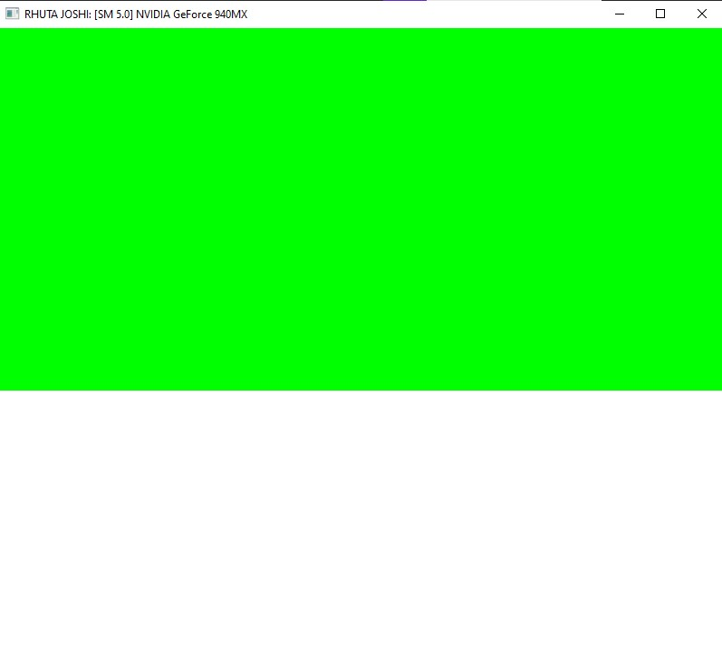
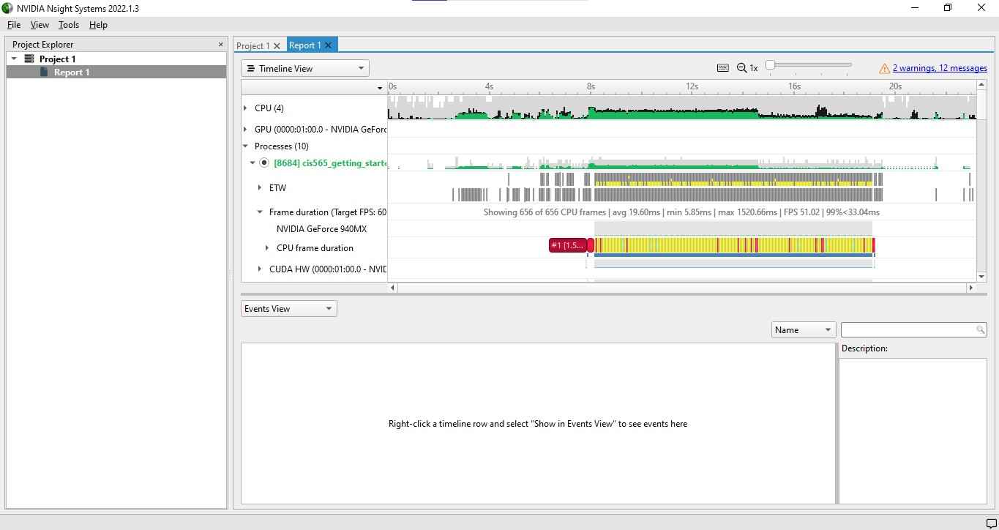
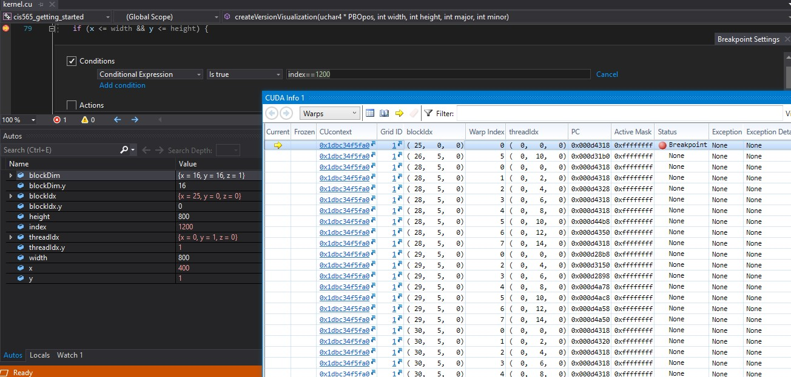
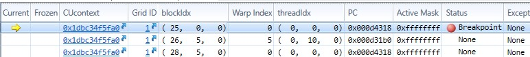
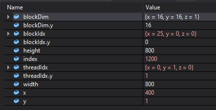
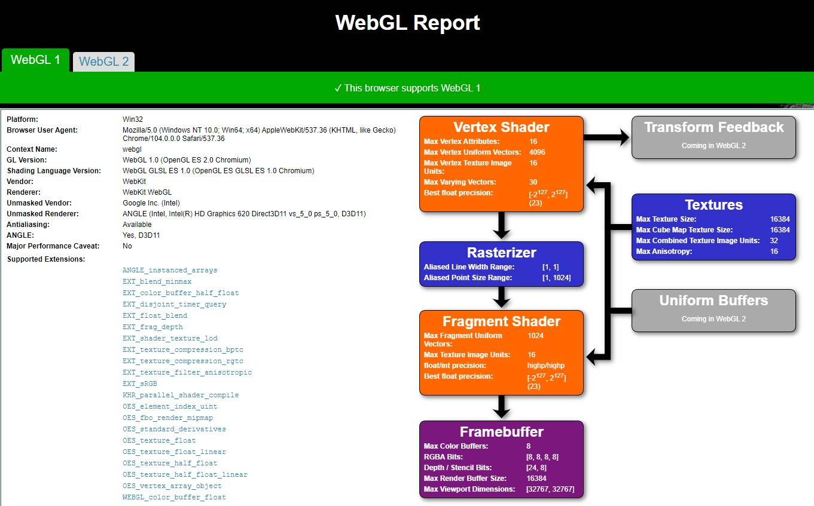
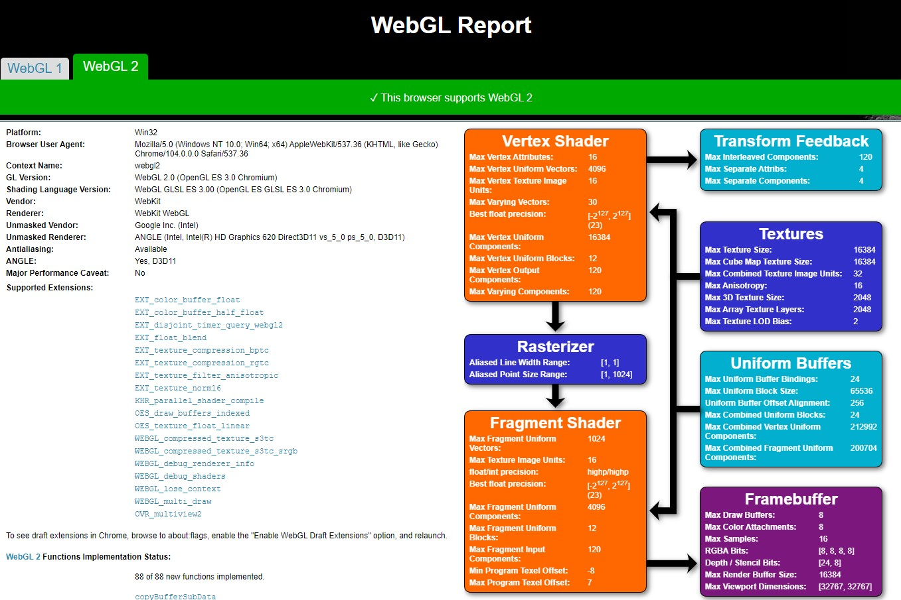

Project 0 Getting Started
====================

**University of Pennsylvania, CIS 565: GPU Programming and Architecture, Project 0**

* RHUTA JOSHI
  * [LinkedIn](https://www.linkedin.com/in/rcj9719/)
  * [Website](https://sites.google.com/view/rhuta-joshi)

* Tested on: Windows 10 Home, i5-7200U CPU @ 2.50GHz, NVIDIA GTX 940MX 4096 MB (Personal Laptop), RTX not supported

# Project Analysis #

## Part 3.1.1: Testing CUDA

## Part 3.1.2: Analyze Performace

## Part 3.1.3: Nsight Debugging

---

---

## Part 3.2: WebGL Support

---

